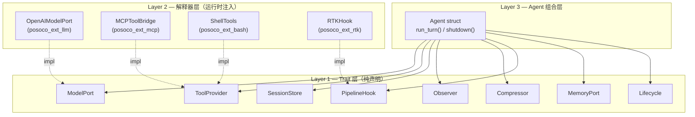
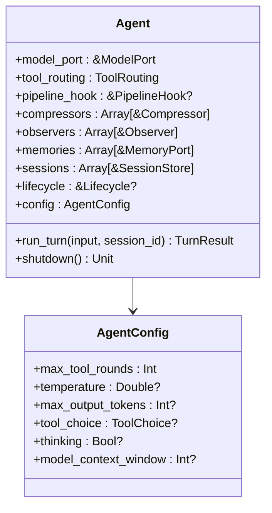
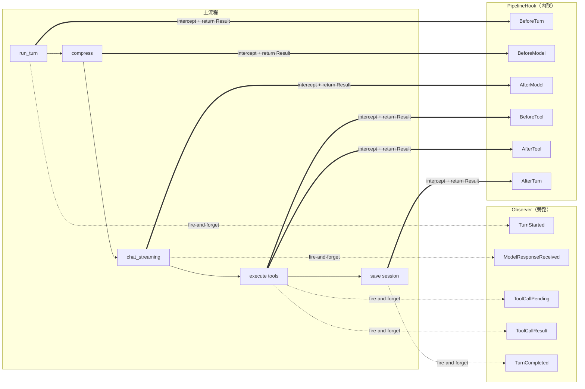
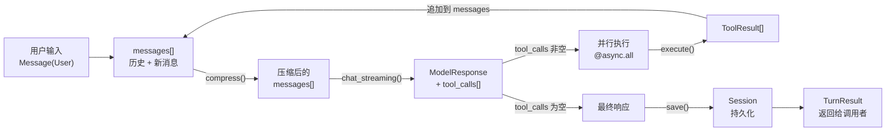
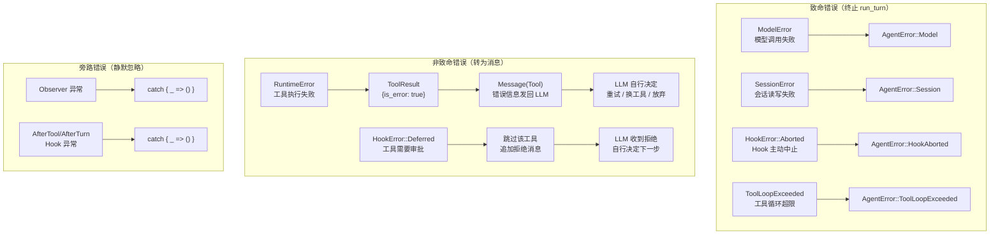
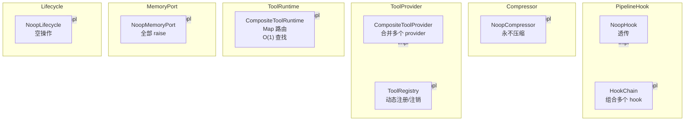

# 02 — Architecture

posoco 的整体架构设计。本文用 mermaid 图展示框架的层次结构、Agent 内部组成、run_turn 生命周期和数据流。

## 概述

posoco 采用**六边形端口（Hexagonal Ports）架构**，核心逻辑不依赖任何具体实现。框架定义 9 个 trait（端口），Agent 作为**组合根**在运行时注入具体实现。

核心原则：
- **Trait 即端口**：每个 trait 是一个解耦边界
- **Agent 是组合根**：Agent struct 在构造时接收所有依赖
- **Observer 是旁路**：不阻塞主流程，只做副作用
- **PipelineHook 是内联拦截**：可修改数据流、中断或延迟

## 三层架构



- **Layer 1**：纯 trait 声明，无实现代码（`src/port.mbt`）
- **Layer 2**：具体实现，可以替换为任意适配器
- **Layer 3**：Agent struct 持有 trait 引用（`&Trait`），运行时多态派发

## Agent 内部结构



### 必需 vs 可选端口

| 端口 | 类型 | 说明 |
|------|------|------|
| ModelPort | `&ModelPort` | **必需** — LLM 调用（单个） |
| ToolProvider | `Array[&ToolProvider]` | **必需** — 声明+执行工具（按名路由） |
| SessionStore | `Array[&SessionStore]` | **必需** — 会话持久化（write-all/read-first） |
| Observer | `Array[&Observer]` | **必需** — 事件旁路（扇出） |
| Compressor | `Array[&Compressor]` | **必需** — 上下文压缩（first-wins） |
| PipelineHook | `Array[&PipelineHook]` | **可选** — 流程拦截（链式） |
| MemoryPort | `Array[&MemoryPort]` | **可选** — 长期记忆（扇出） |
| Lifecycle | `&Lifecycle?` | **可选** — 资源清理 |

## run_turn 生命周期

这是 posoco 最核心的流程。一次 `run_turn` 调用完成从用户输入到最终响应的全部工作。

```mermaid
flowchart TD
  START(["run_turn(input, session_id)"]) --> HOOK_BT{"pipeline_hook?"}

  HOOK_BT -->|Some| CALL_BT["hook.on_stage(BeforeTurn)"]
  HOOK_BT -->|None| OBS_START
  CALL_BT -->|Ok| OBS_START
  CALL_BT -->|Err| ABORT(["raise AgentError"])

  OBS_START["observer.on_event(TurnStarted)"] --> LOAD["session_store.load(session_id)"]
  LOAD -->|Ok| ADD_INPUT["messages.push(input)"]
  LOAD -->|Err| SESSION_ERR(["raise AgentError::Session"])

  ADD_INPUT --> LIST_TOOLS["merge all tool_routing.providers"]
  LIST_TOOLS --> COMPRESS["compressors.first_non_none()"]

  COMPRESS --> C_DECIDE{"CompressAction?"}
  C_DECIDE -->|None| HOOK_BM
  C_DECIDE -->|Replace| USE_REPL["messages = replaced"]
  C_DECIDE -->|NewThread| NEW_THREAD["save new session + SessionRedirect event"]
  USE_REPL --> HOOK_BM
  NEW_THREAD --> HOOK_BM

  HOOK_BM{"pipeline_hook?"}
  HOOK_BM -->|Some| CALL_BM["hook.on_stage(BeforeModel(msgs))"]
  HOOK_BM -->|None| MODEL
  CALL_BM -->|Ok(BeforeModel(m))| MODEL["model_port.chat_streaming(...)"]
  CALL_BM -->|Err| ABORT2(["raise AgentError"])

  MODEL -->|Ok| AFTER_M["observer.on_event(ModelResponseReceived)"]
  MODEL -->|Err| MODEL_ERR["observer.on_event(TurnFailed) → raise"]

  AFTER_M --> HOOK_AM{"hook.on_stage(AfterModel)"}
  HOOK_AM --> HAS_TOOLS{"response.tool_calls?"}

  HAS_TOOLS -->|empty| SAVE_FINAL
  HAS_TOOLS -->|non-empty| TOOL_LOOP

  TOOL_LOOP["tool_round++"] --> EXCEED{"tool_round > max?"}
  EXCEED -->|yes| LOOP_ERR(["raise ToolLoopExceeded"])
  EXCEED -->|no| BEFORE_TOOL

  BEFORE_TOOL["hook.on_stage(BeforeTool(call))"] --> BT_RESULT{"Hook 结果?"}
  BT_RESULT -->|Ok(BeforeTool(tc))| APPROVE["approved_calls.push(tc)"]
  BT_RESULT -->|Err Deferred| DEFER["ToolCallDeferred + skip"]
  BT_RESULT -->|Err Aborted| ABORT3(["raise AgentError"])

  APPROVE --> EXEC["@async.all: execute approved calls"]
  DEFER --> RESOLUTION{"resolution_required?"}
  EXEC --> MERGE["merge results → messages"]
  MERGE --> RESOLUTION

  RESOLUTION -->|yes| SAVE_FINAL
  RESOLUTION -->|no| HOOK_BM

  SAVE_FINAL["session_store.save()"] --> OBS_DONE["observer.on_event(TurnCompleted)"]
  OBS_DONE --> HOOK_AT["hook.on_stage(AfterTurn)"]
  HOOK_AT --> RETURN(["return TurnResult"])
```

### 关键流程说明

1. **BeforeTurn**：PipelineHook 可在此做初始化工作。返回 `Err` 直接终止 turn。
2. **Session Load**：加载历史消息。不存在则返回空 session。
3. **Compress**：Compressor 决定是否压缩上下文。`NewThread` 会创建新 session 并重定向。
4. **BeforeModel**：PipelineHook 可修改发送给模型的消息数组（如注入 system prompt）。
5. **chat_streaming**：调用模型，流式回调通过 Observer 发出 `StreamChunkReceived` 事件。
6. **Tool Loop**：当模型返回 tool_calls 时进入循环。多个 tool_calls 通过 `@async.all` 并行执行。
7. **BeforeTool**：PipelineHook 可修改工具参数（如 RTK token 优化）或拒绝执行（Deferred）。
8. **Session Save**：持久化最终的消息历史。
9. **AfterTurn**：PipelineHook 的最终通知。

## Observer vs PipelineHook



| 特性 | Observer | PipelineHook |
|------|----------|-------------|
| 返回值 | `Unit` | `Result[Stage, HookError]` |
| 阻塞主流程 | ❌ 不阻塞 | ✅ 可阻塞 |
| 修改数据 | ❌ 只读 | ✅ 可修改 Stage |
| 中断流程 | ❌ | ✅ 返回 `Err(Aborted)` |
| 延迟执行 | ❌ | ✅ 返回 `Err(Deferred)` |
| 适用场景 | 日志、指标、UI 更新 | 审批、改写、审计 |

## 数据流



核心数据流是一个 **循环**：

1. 用户消息追加到 session 的 messages 数组
2. Compressor 可选压缩
3. ModelPort 处理 messages → 返回 ModelResponse
4. 如果有 tool_calls → 并行执行 → 结果追加到 messages → 回到步骤 2
5. 如果没有 tool_calls → 保存 session → 返回 TurnResult

## 错误传播



### 错误类型一览

| 错误 | 来源 | 致命？ | 处理方式 |
|------|------|--------|----------|
| `ModelError::RequestBuild` | ModelPort.chat 请求构建失败 | ✅ | raise AgentError::Model |
| `ModelError::Transport` | ModelPort.chat 网络错误 | ✅ | raise AgentError::Model |
| `ModelError::ResponseParse` | ModelPort.chat 响应解析失败 | ✅ | raise AgentError::Model |
| `SessionError::Load` | SessionStore.load 失败 | ✅ | raise AgentError::Session |
| `SessionError::Save` | SessionStore.save 失败 | ✅ | raise AgentError::Session |
| `RuntimeError::UnknownTool` | ToolRuntime 找不到工具 | ❌ | 转为 ToolResult(is_error=true) |
| `RuntimeError::InvocationFailed` | 工具执行失败 | ❌ | 转为 ToolResult(is_error=true) |
| `RuntimeError::Transport` | 工具网络错误 | ❌ | 转为 ToolResult(is_error=true) |
| `HookError::Aborted` | PipelineHook 主动中止 | ✅ | raise AgentError::HookAborted |
| `HookError::Deferred` | PipelineHook 延迟工具 | ❌ | 跳过工具，LLM 收到拒绝 |
| `MemoryError::*` | MemoryPort 操作失败 | ✅ | raise（调用方处理） |

## 内置组件



### 内置组件速查

| 组件 | 实现的 Trait | 功能 | 适用场景 |
|------|-------------|------|----------|
| `NoopCompressor` | Compressor | 永不压缩，返回 `None` | 默认值、简单 Agent |
| `NoopHook` | PipelineHook | 透传所有 Stage | 测试、不需要 hook 时 |
| `HookChain` | PipelineHook | 按序调用多个 hook，短路 Err | 组合审计 + 改写 hook |
| `CompositeToolProvider` | ToolProvider | 合并多个 provider 的工具列表 | 多来源工具 |
| `CompositeToolRuntime` | ToolRuntime | Map 路由，O(1) 查找 | 多运行时路由（bash + MCP） |
| `ToolRegistry` | ToolProvider | 动态注册/注销工具 | 运行时工具管理 |
| `NoopMemoryPort` | MemoryPort | 所有操作 raise | 不需要记忆时占位 |
| `NoopLifecycle` | Lifecycle | 空操作 shutdown | 无资源需要清理 |

## 下一步

- [03-trait-recipes.md](03-trait-recipes.md) — 每个 trait 的详细实现配方和代码模板
- [04-developer-guide.md](04-developer-guide.md) — 完整开发指南
- [05-streaming-guide.md](05-streaming-guide.md) — 流式响应专题
