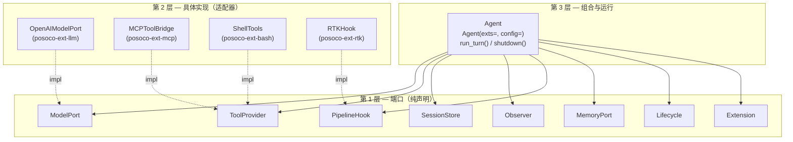
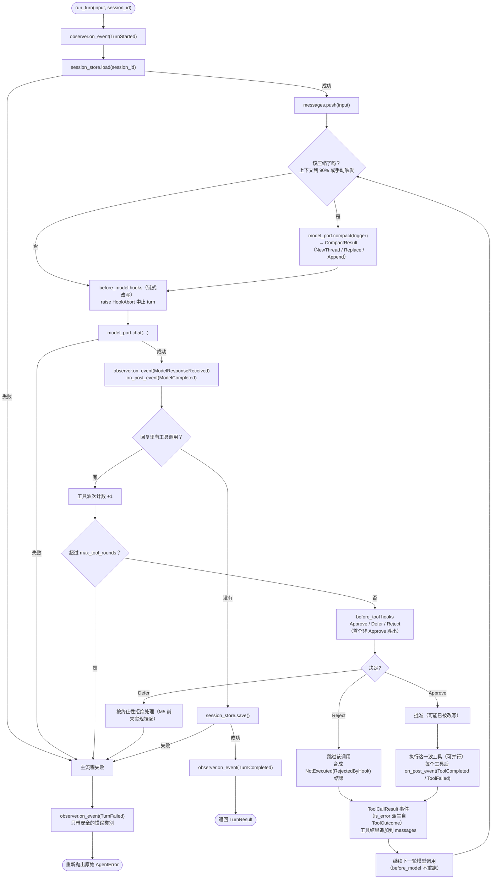
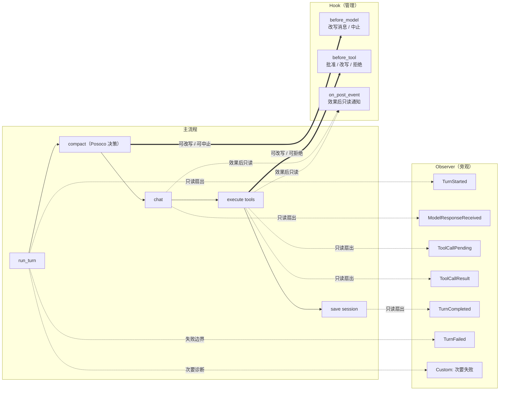
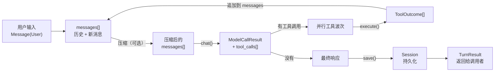
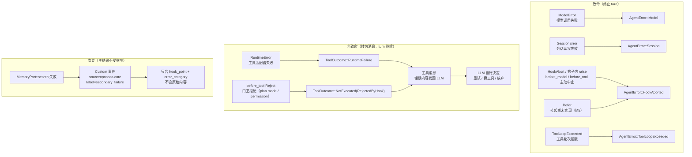

# 02 — 架构入门

本文讲清楚 Posoco 的整体设计：它由哪些层次组成、一次 `run_turn` 内部发生了什么、
错误怎么分类、以及 Observer 和 PipelineHook 有什么区别。读完你会有一个完整的心理模型，
写扩展时知道自己的代码会被放在哪里、以什么方式被调用。

## 1. 设计思想：端口与适配器

Posoco 采用**六边形（端口-适配器）架构**：框架核心不依赖任何具体实现。核心只
认识一组接口——端口（port，即公开 trait），比如 `ModelPort`、`SessionStore`、
`ToolProvider`。具体实现（OpenAI 适配器、文件存储、Bash 工具……）都是插在端口
上的**适配器**，随时可以替换。

三个核心原则：

- **Trait 即端口**。每个 trait 都是一道解耦边界：核心逻辑只面向 trait 编程，
  不知道也不关心背后是哪个 provider。
- **Agent 是组合根**。`Agent(exts=..., config=...)` 在构造时汇总所有扩展的
  manifest，把端口接好，随后一切由它驱动。你不需要自己"接线"。
- **扩展自报家门**。每个扩展通过 `Extension::manifest` 声明自己提供了哪些端口，
  一个值可以同时提供多个端口（比如同一个 struct 既当模型又当存储）。

## 2. 三层架构

```mermaid
graph TD
  subgraph "第 3 层 — 组合与运行"
    Agent["Agent<br/>Agent(exts=, config=)<br/>run_turn() / shutdown()"]
  end

  subgraph "第 2 层 — 具体实现（适配器）"
    OAI["OpenAIModelPort<br/>(posoco-ext-llm)"]
    MCP["MCPToolBridge<br/>(posoco-ext-mcp)"]
    SHELL["ShellTools<br/>(posoco-ext-bash)"]
    RTK["RTKHook<br/>(posoco-ext-rtk)"]
  end

  subgraph "第 1 层 — 端口（纯声明）"
    MP["ModelPort"]
    TP["ToolProvider"]
    SS["SessionStore"]
    OB["Observer"]
    HK["PipelineHook"]
    ME["MemoryPort"]
    LC["Lifecycle"]
    EX["Extension"]
  end

  Agent --> MP & TP & SS & OB & HK & ME & LC & EX

  OAI -.->|impl| MP
  MCP -.->|impl| TP
  SHELL -.->|impl| TP
  RTK -.->|impl| HK
```

- **第 1 层**：端口声明，只有签名没有实现（`src/port/`）。
- **第 2 层**：你写的适配器。想换一个模型？换一个实现 `ModelPort` 的 struct 即可，
  其他代码一行不用改。
- **第 3 层**：Agent。它持有各端口的引用（`&Trait`），运行时按接口派发调用。

你作为扩展开发者主要在第 1、2 层工作；第 3 层的内部执行细节你不需要了解。

## 3. 端口一览

| 端口 | 数量 | 必需？ | 干什么用的 |
|------|------|--------|-----------|
| `ModelPort` | 恰好一个 | ✅ 必需 | 调用 LLM；对话压缩也是它的能力 |
| `SessionStore` | 至少一个 | ✅ 必需 | 对话记录与元数据的持久化 |
| `ToolProvider` | 任意 | 可选 | 声明并执行工具 |
| `Observer` | 任意 | 可选 | 只读旁观：收到 turn 生命周期事件 |
| `PipelineHook` | 任意 | 可选 | 插手流程：改写消息、审批工具调用 |
| `MemoryPort` | 任意 | 可选 | 跨会话的长期记忆 |
| `Lifecycle` | 任意 | 可选 | Agent 关闭时的资源清理 |

Agent 在构造时汇总所有 manifest，并做一次**快速失败（fail-fast）**校验：缺模型、
缺存储、工具重名、命令重名，都会立刻抛 `CompositionError`——绝不存在"先凑合跑，
运行时再报错"的情况。工具重名时错误信息会带上每个 `ToolDef.provenance`
（来源标签），方便你定位是哪个扩展声明的。

## 4. run_turn 生命周期

一次 `run_turn(input, session_id)` 从用户输入出发，走完整个对话回合。它是
Posoco 最核心的流程：

```mermaid
flowchart TD
  START(["run_turn(input, session_id)"]) --> OBS_START["observer.on_event(TurnStarted)"]
  OBS_START --> LOAD["session_store.load(session_id)"]
  LOAD -->|成功| ADD_INPUT["messages.push(input)"]
  LOAD -->|失败| FATAL

  ADD_INPUT --> COMPACT{"该压缩了吗？<br/>上下文到 90% 或手动触发"}
  COMPACT -->|是| CALL_COMPACT["model_port.compact(trigger)<br/>→ CompactResult（NewThread / Replace / Append）"]
  COMPACT -->|否| HOOK_BM
  CALL_COMPACT --> HOOK_BM

  HOOK_BM["before_model hooks（链式改写）<br/>raise HookAbort 中止 turn"] --> MODEL["model_port.chat(...)"]

  MODEL -->|成功| AFTER_M["observer.on_event(ModelResponseReceived)<br/>on_post_event(ModelCompleted)"]
  MODEL -->|失败| FATAL

  AFTER_M --> HAS_TOOLS{"回复里有工具调用？"}

  HAS_TOOLS -->|没有| SAVE_FINAL
  HAS_TOOLS -->|有| TOOL_LOOP

  TOOL_LOOP["工具波次计数 +1"] --> EXCEED{"超过 max_tool_rounds？"}
  EXCEED -->|是| FATAL
  EXCEED -->|否| BEFORE_TOOL

  BEFORE_TOOL["before_tool hooks<br/>Approve / Defer / Reject（首个非 Approve 胜出）"] --> BT_RESULT{"决定?"}
  BT_RESULT -->|Approve| APPROVE["批准（可能已被改写）"]
  BT_RESULT -->|Defer| TERM_REJECT["按终止性拒绝处理（M5 前未实现挂起）"]
  BT_RESULT -->|Reject| SKIP["跳过该调用<br/>合成 NotExecuted(RejectedByHook) 结果"]

  APPROVE --> EXEC["执行这一波工具（可并行）<br/>每个工具后 on_post_event(ToolCompleted / ToolFailed)"]
  TERM_REJECT --> FATAL
  SKIP --> MERGE
  EXEC --> MERGE["ToolCallResult 事件（is_error 派生自 ToolOutcome）<br/>工具结果追加到 messages"]

  MERGE --> NEXT_MODEL["继续下一轮模型调用（before_model 不重跑）"]
  NEXT_MODEL --> COMPACT

  SAVE_FINAL["session_store.save()"] -->|成功| OBS_DONE["observer.on_event(TurnCompleted)"]
  SAVE_FINAL -->|失败| FATAL
  OBS_DONE --> RETURN(["返回 TurnResult"])

  FATAL["主流程失败"] --> OBS_FAIL["observer.on_event(TurnFailed)<br/>只带安全的错误类别"]
  OBS_FAIL --> RERAISE(["重新抛出原始 AgentError"])
```

要点：

1. **开始**：turn 启动时先发布一次 `TurnStarted`。在此之前的失败（比如组装出错）
   不会有任何 terminal 事件。
2. **加载历史**：从 session store 读历史消息，追加新输入。查不到就是空 session，
   一段新对话。
3. **压缩决策**：Posoco 决定**何时**压缩（上下文用到 90% 自动触发，或由宿主手动
   触发）；`ModelPort::compact` 决定**怎么做**（`NewThread` 会开一条新会话线程并
   重定向，原来的会话保留）。压缩不是独立端口，它由模型适配器承担。
4. **模型调用前**：`before_model` hooks 可以链式改写发给模型的消息（比如注入
   system prompt），也可以 raise `HookAbort` 中止整个 turn。同一 turn 里后续的
   工具波次不会重复执行它。
5. **模型调用**：`ModelPort::chat`。流式模式下回调产生的增量事件会投影成
   `StreamChunkReceived` 事件（详见 05 流式指南）。
6. **工具波次**：模型回复里有工具调用时，Agent 按工具名路由给对应的 provider
   并执行这一波（可并行），然后把结果追加回消息，进入下一轮模型调用。扩展不需要
   自己实现这套循环。
7. **工具审批**：`before_tool` 对每个待执行调用返回 `Approve`（可顺手改写）/
   `Defer` / `Reject`。第一个非 `Approve` 的决定胜出。`Reject` 是引导而非失败：
   该调用不执行，拒绝理由以 `NotExecuted(RejectedByHook)` 工具结果回喂模型，
   run 继续进入下一轮模型调用（plan mode、permission 等门卫依赖这一点来纠正模型，
   而不是杀死 turn）。目前 `Defer` 仍按终止性拒绝处理（挂起/恢复尚未实现），
   从钩子里 raise 仍是终止路径。
8. **保存**：把最终消息历史写回 session store，发布 `TurnCompleted`。
9. **失败**：任何主流程失败（模型错误、存储错误、hook 中止、工具轮次超限）都会
   发布一次 `TurnFailed`（只带安全的错误类别，不泄漏 prompt、参数等原始内容），
   然后把原始 `AgentError` 重新抛给调用方。

## 5. Observer 与 Hook：看与管

两者都挂在流程上，但职责截然不同：

- **Observer 是旁观者**：只读，收到事件后自己决定做什么（打日志、更新 UI、记
  指标）。它不返回任何东西，也不影响流程。如果 observer 违反合同（比如在回调里
  抛了不该抛的错误），这个失败会保持 loud，让宿主能发现——绝不静默吞掉。
- **Hook 是管理员**：在拦截点**改写或阻止**。`before_model` 可以改消息、可以
  中止；`before_tool` 可以批准、改写、拒绝；`on_post_event` 则是效果完成后的
  只读通知（区别于 Observer 的 turn 级事件，它按效果粒度触发）。

```mermaid
graph LR
  subgraph "主流程"
    A["run_turn"] --> B["compact（Posoco 决策）"]
    B --> C["chat"]
    C --> D["execute tools"]
    D --> E["save session"]
  end

  subgraph "Observer（旁观）"
    O1["TurnStarted"]
    O2["ModelResponseReceived"]
    O3["ToolCallPending"]
    O4["ToolCallResult"]
    O5["TurnCompleted"]
    O6["TurnFailed"]
    O7["Custom: 次要失败"]
  end

  subgraph "Hook（管理）"
    H1["before_model<br/>改写消息 / 中止"]
    H2["before_tool<br/>批准 / 改写 / 拒绝"]
    H3["on_post_event<br/>效果后只读通知"]
  end

  A -.->|只读扇出| O1
  C -.->|只读扇出| O2
  D -.->|只读扇出| O3
  D -.->|只读扇出| O4
  E -.->|只读扇出| O5
  A -.->|失败边界| O6
  A -.->|次要诊断| O7

  B ==>|可改写 / 可中止| H1
  D ==>|可改写 / 可拒绝| H2
  C -.->|效果后只读| H3
  D -.->|效果后只读| H3
```

| 特性 | Observer | Hook |
|------|----------|------|
| 返回值 | `Unit`（无错误通道） | `before_model` → 消息数组；`before_tool` → 决定；`on_post_event` → `Unit` |
| 能否阻塞主流程 | 不能 | `before_model` 可中止；`before_tool` 可拒绝 |
| 能否修改数据 | ❌ 只读 | ✅ `before_model` 改消息；`before_tool` 改调用 |
| 能否中断流程 | ❌ | ✅ 中止或拒绝 |
| 典型用途 | 日志、指标、UI 更新 | 审批、改写、审计 |

## 6. 数据流与快照

```mermaid
flowchart LR
  INPUT["用户输入<br/>Message(User)"] --> MESSAGES["messages[]<br/>历史 + 新消息"]

  MESSAGES -->|"压缩（可选）"| COMPACTED["压缩后的<br/>messages[]"]
  COMPACTED -->|"chat()"| RESPONSE["ModelCallResult<br/>+ tool_calls[]"]

  RESPONSE -->|"有工具调用"| PARALLEL["并行工具波次"]
  RESPONSE -->|"没有"| FINAL["最终响应"]

  PARALLEL -->|"execute()"| RESULTS["ToolOutcome[]"]
  RESULTS -->|"追加到 messages"| MESSAGES

  FINAL -->|"save()"| SESSION["Session<br/>持久化"]
  SESSION --> TURN["TurnResult<br/>返回给调用者"]
```

核心是一个**循环**：用户消息进 `messages` →（必要时压缩）→ 模型调用 → 如果有
工具调用就执行并把结果追加回去 → 再调模型……直到模型给出纯文本回复 → 保存。

一个重要细节：**所有边界都传独立快照（snapshot）**。消息内容、工具参数、session
metadata、工具结果、JSON 数据——凡是跨边界传递的可变数据，Agent 都会复制一份再
交出去。这样 load、hook、模型调用、save、observer 之间永远不会共享同一个可变
数组或 Map，谁也不可能在背后悄悄改掉别人的数据。只有 `before_model` /
`before_tool` 明确返回并被框架接受的新消息 / 新调用，才能影响主数据流。

推理（reasoning）内容沿消息链路传递：请求侧通过模型配置控制，响应侧出现在
`AssistantMessage.reasoning` 和 `Completion.reasoning` 里。`ChatOptions` 只保留
所有 provider 通用的 `temperature` 与 `max_output_tokens`；各家特有的参数
（tool choice、reasoning effort 等）属于具体模型适配器的配置，不要混进共享类型。

## 7. 错误模型：致命、非致命、次要

```mermaid
flowchart TD
  subgraph "致命（终止 turn）"
    M_ERR["ModelError<br/>模型调用失败"] --> AGENT["AgentError::Model"]
    S_ERR["SessionError<br/>会话读写失败"] --> AGENT2["AgentError::Session"]
    H_ABORT["HookAbort / 钩子内 raise<br/>before_model / before_tool 主动中止"] --> AGENT3["AgentError::HookAborted"]
    H_DEFER["Defer<br/>挂起尚未实现（M5）"] --> AGENT3
    T_LOOP["ToolLoopExceeded<br/>工具轮次超限"] --> AGENT4["AgentError::ToolLoopExceeded"]
  end

  subgraph "非致命（转为消息，turn 继续）"
    R_ERR["RuntimeError<br/>工具适配器失败"] --> TOOL_RESULT["ToolOutcome::RuntimeFailure"]
    TOOL_RESULT --> MSG["工具消息<br/>错误内容发回 LLM"]
    H_REJECT["before_tool Reject<br/>门卫拒绝（plan mode / permission）"] --> NOT_EXEC["ToolOutcome::NotExecuted(RejectedByHook)"]
    NOT_EXEC --> MSG
    MSG --> LLM_DECIDE["LLM 自行决定<br/>重试 / 换工具 / 放弃"]
  end

  subgraph "次要（主结果不受影响）"
    AFTER_HOOK["MemoryPort::search 失败"] --> DIAG["Custom 事件<br/>source=posoco.core<br/>label=secondary_failure"]
    DIAG --> SAFE_FIELDS["只含 hook_point + error_category<br/>不含原始内容"]
  end
```

| 错误类别 | 例子 | 致命？ | 怎么处理 |
|----------|------|--------|----------|
| 模型错误 | 请求构建失败、网络错误、响应解析失败 | ✅ | raise `AgentError::Model` |
| 会话错误 | load / save 失败 | ✅ | raise `AgentError::Session` |
| Hook 中止 | `before_model` 抛 `HookAbort`；钩子内 raise | ✅ | raise `AgentError::HookAborted` |
| Hook 挂起 | `before_tool` 返回 `Defer`（M5 前未实现） | ✅ | raise `AgentError::HookAborted` |
| 工具轮次超限 | 超过 `max_tool_rounds` | ✅ | raise `AgentError::ToolLoopExceeded` |
| 工具运行时失败 | 适配器抛 `RuntimeError` | ❌ | 转为 `ToolOutcome::RuntimeFailure`，作为消息回给模型 |
| Hook 拒绝 | `before_tool` 返回 `Reject` | ❌ | 转为 `NotExecuted(RejectedByHook)`，拒绝理由作为消息回给模型 |
| 工具业务失败 | 参数不对、业务拒绝 | ❌ | `ToolOutcome::ToolReportedError`，作为消息回给模型 |
| 次要组件失败 | 记忆检索失败 | ❌ | 发布清洗过的 `Custom` 事件，主结果不变 |

记住一句话：**工具的失败是模型看到的素材，模型的失败才是 turn 的终结。**

错误信息是**干净**的：`TurnFailed` 只携带安全的错误类别，`TurnResult` 错误和
事件里的诊断信息不会回显 prompt、工具参数或原始 provider 载荷；流式工具调用的
解析错误只报告 index，不回显模型提供的 id、name 或原始 arguments。

`Agent::shutdown` 同样不吞错误：`Lifecycle` 清理失败会直接向调用方爆出，宿主
决定重试还是终止。

## 8. 内置组件

| 组件 | 实现的端口 | 作用 | 什么时候用 |
|------|-----------|------|-----------|
| Agent 内置工具路由 | ToolProvider | 合并多个 provider，按工具名路由 | Agent 自动处理，无需你组装 |
| `ToolRegistry` | ToolProvider | 运行期动态注册 / 注销工具 | 工具集合会变化的场景 |
| `NoopMemoryPort` | MemoryPort | 所有操作抛错 | 不需要记忆时的占位 |
| `NoopLifecycle` | Lifecycle | shutdown 空操作 | 没有资源需要清理 |

Hook 不需要内置占位类型——`Hook` 的每个方法都有默认实现（透传 / 一律批准 /
空操作），你只覆盖关心的拦截点即可。压缩也不需要内置组件——它就是
`ModelPort::compact` 一个方法的事。