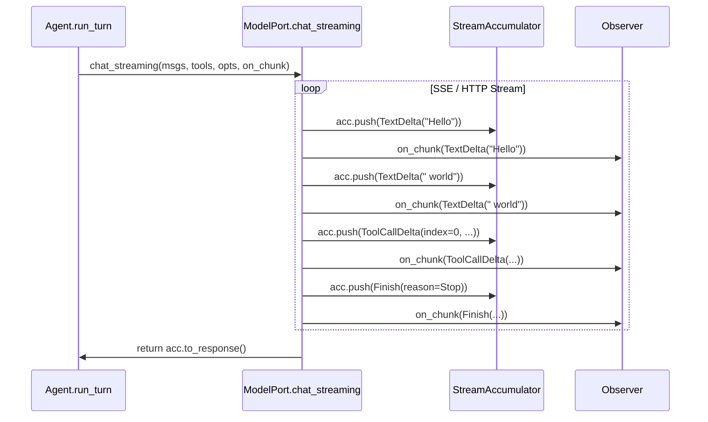
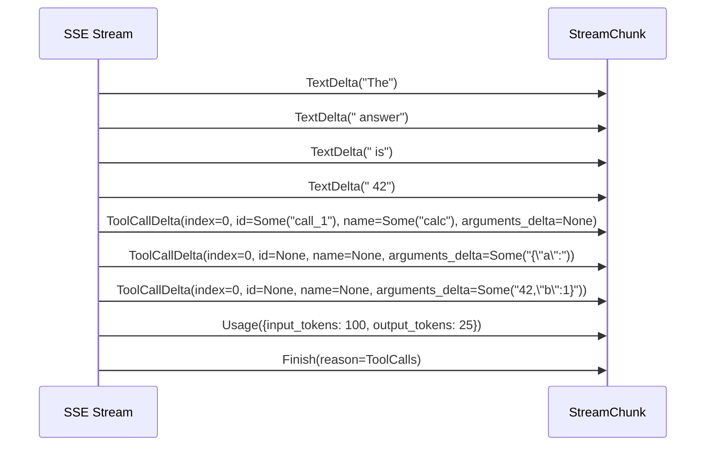

# 05 — Streaming Guide

posoco 流式响应的完整指南：StreamChunk、StreamAccumulator、ToolCallBuilder，以及如何实现和消费流式事件。

> 类型定义来源于 `src/types.mbt:72-184`，默认 fallback 来源于 `src/builtin.mbt:6-16`。

---

## 流式架构



### 流程说明

1. Agent 调用 `model_port.chat_streaming(messages, tools, options, on_chunk)`
2. ModelPort 实现（如 OpenAI）打开 SSE 连接
3. 每解析一个事件，调用 `on_chunk(chunk)` **两次**：
   - 一次传给 `StreamAccumulator`（累积为最终响应）
   - 一次传给 `Observer`（通过 `StreamChunkReceived` 事件通知外部）
4. 流结束后，`acc.to_response()` 返回完整的 `ModelResponse`

### 默认行为

如果 ModelPort 只实现了 `chat()` 而没有 override `chat_streaming()`，默认 fallback 会忽略 `on_chunk` 直接调用 `chat()`：

```moonbit
// src/builtin.mbt — 默认 fallback
impl ModelPort with fn chat_streaming(
  self : Self,
  messages : Array[Message],
  tools : Array[ToolDef],
  options : ChatOptions,
  _on_chunk : (StreamChunk) -> Unit,  // 被忽略
) -> ModelResponse raise ModelError {
  self.chat(messages, tools, options)  // 直接调用非流式版本
}
```

---

## StreamChunk 类型参考

```moonbit
pub(all) enum StreamChunk {
  TextDelta(token~ : String)                    // 文本 token
  ReasoningDelta(token~ : String)               // 思维链 token
  ToolCallDelta(                                 // 工具调用增量
    index~ : Int,                                //   工具调用索引（从 0 开始）
    id~ : String?,                               //   调用 ID（通常在第一个 delta 出现）
    name~ : String?,                             //   工具名（通常在第一个 delta 出现）
    arguments_delta~ : String?                   //   参数 JSON 片段
  )
  Usage(Usage)                                   // token 用量
  Finish(reason~ : FinishReason)                 // 流结束信号
}
```

### 变体说明

| 变体 | 出现时机 | 字段 |
|------|----------|------|
| `TextDelta` | 每生成一个文本 token | `token` — 单个或多个字符 |
| `ReasoningDelta` | 思维链模式启用时 | `token` — 推理过程文本 |
| `ToolCallDelta` | LLM 决定调用工具时 | `index` 定位，`id/name/arguments_delta` 增量 |
| `Usage` | 通常在流结束时 | `input_tokens/output_tokens/total_tokens` |
| `Finish` | 流的最后一条 | `reason` — Stop / Length / ToolCalls / Other |

### 典型 chunk 时序



---

## StreamAccumulator

将增量 StreamChunk 累积为完整的 `ModelResponse`。

### API

```moonbit
pub(all) struct StreamAccumulator {
  mut text : String                           // 累积的文本
  mut reasoning : String                      // 累积的推理文本
  tool_calls : Array[ToolCallBuilder]         // 按 index 的工具调用构建器
  mut finish_reason : FinishReason            // 默认 Stop
  mut usage : Usage?
}

pub fn StreamAccumulator::new() -> StreamAccumulator
pub fn StreamAccumulator::push(self, chunk : StreamChunk) -> Unit
pub fn StreamAccumulator::to_response(self) -> ModelResponse
```

### 使用模式

```moonbit
let acc = @posoco.StreamAccumulator::new()

// 逐个 push chunk
acc.push(TextDelta(token="Hello"))
acc.push(TextDelta(token=" world"))
acc.push(Finish(reason=Stop))
acc.push(Usage({ input_tokens: Some(10), output_tokens: Some(2), total_tokens: Some(12) }))

// 转为最终响应
let response = acc.to_response()
// response.message.content == [Text("Hello world")]
// response.finish_reason == Stop
// response.usage == Some({ input_tokens: 10, output_tokens: 2, total_tokens: 12 })
```

### push 行为详解

```moonbit
pub fn StreamAccumulator::push(self, chunk : StreamChunk) -> Unit {
  match chunk {
    TextDelta(token~) =>
      self.text = self.text + token             // 追加文本

    ReasoningDelta(token~) =>
      self.reasoning = self.reasoning + token   // 追加推理

    ToolCallDelta(index~, id~, name~, arguments_delta~) => {
      // 确保 tool_calls 数组足够长
      while self.tool_calls.length() <= index {
        self.tool_calls.push(ToolCallBuilder::new())
      }
      let builder = self.tool_calls[index]
      match id { Some(v) => builder.id = v; None => () }
      match name { Some(v) => builder.name = v; None => () }
      match arguments_delta {
        Some(delta) => builder.arguments_json = builder.arguments_json + delta
        None => ()
      }
    }

    Usage(usage) => self.usage = Some(usage)    // 覆盖用量
    Finish(reason~) => self.finish_reason = reason  // 覆盖结束原因
  }
}
```

### to_response 转换规则

```moonbit
pub fn StreamAccumulator::to_response(self) -> ModelResponse {
  // 1. 构建 ToolCall 数组
  //    - 过滤掉空的 builder（id == "" && arguments_json == ""）
  //    - arguments_json 解析为 Json（失败则用空 object）
  //
  // 2. 构建 Message
  //    - role: Assistant
  //    - content: [Text(accumulated_text)]（如果 text 非空）
  //    - tool_calls: 从 builder 转换
  //
  // 3. reasoning_summary: 如果 reasoning 非空则 Some(reasoning)
  // 4. finish_reason: 累积的 Finish 值
  // 5. usage: 累积的 Usage 值
}
```

---

## ToolCallBuilder

`ToolCallBuilder` 是 `StreamAccumulator` 内部使用的辅助结构，将多个 `ToolCallDelta` 增量累积为一个完整的 `ToolCall`。

### 结构

```moonbit
pub(all) struct ToolCallBuilder {
  mut id : String              // 工具调用 ID
  mut name : String            // 工具名
  mut arguments_json : String  // 参数 JSON 字符串（增量拼接）
}
```

### 累积过程

```
ToolCallDelta(index=0, id=Some("call_1"), name=None, arguments_delta=None)
  → builder[0] = { id: "call_1", name: "", arguments_json: "" }

ToolCallDelta(index=0, id=None, name=Some("bash"), arguments_delta=None)
  → builder[0] = { id: "call_1", name: "bash", arguments_json: "" }

ToolCallDelta(index=0, id=None, name=None, arguments_delta=Some("{\"cmd\":"))
  → builder[0] = { id: "call_1", name: "bash", arguments_json: "{\"cmd\":" }

ToolCallDelta(index=0, id=None, name=None, arguments_delta=Some("\"ls\"}"))
  → builder[0] = { id: "call_1", name: "bash", arguments_json: "{\"cmd\":\"ls\"}" }

to_response() → ToolCall { id: "call_1", name: "bash", arguments: Json::parse("{\"cmd\":\"ls\"}") }
```

### 多工具调用

LLM 可能一次返回多个工具调用，每个有不同的 `index`：

```
ToolCallDelta(index=0, id=Some("call_1"), name=Some("bash"), ...)
ToolCallDelta(index=1, id=Some("call_2"), name=Some("search"), ...)
ToolCallDelta(index=0, arguments_delta=Some("{\"cmd\":\"ls\"}"))
ToolCallDelta(index=1, arguments_delta=Some("{\"query\":\"hello\"}"))
```

StreamAccumulator 内部维护 `Array[ToolCallBuilder]`，按 `index` 自动扩容。

---

## 实现流式 ModelPort

### Step-by-step

1. Override `chat_streaming`
2. 打开 SSE/HTTP 流
3. 逐事件解析
4. 对每个事件调用 `on_chunk(chunk)` + `acc.push(chunk)`
5. 流结束后返回 `acc.to_response()`

### 完整模板（OpenAI Responses API）

```moonbit
pub impl @posoco.ModelPort for OpenAIModelPort with fn chat_streaming(
  self : OpenAIModelPort,
  messages : Array[@posoco.Message],
  tools : Array[@posoco.ToolDef],
  options : @posoco.ChatOptions,
  on_chunk : (@posoco.StreamChunk) -> Unit,
) -> @posoco.ModelResponse raise @posoco.ModelError {
  // 1. 构建请求体
  let body = build_request_body(messages, tools, options, stream=true)

  // 2. 建立 HTTP 连接
  let client = @http.Client::new(self.config.base_url, [
    ("Authorization", "Bearer " + self.config.api_key),
    ("Content-Type", "application/json"),
  ]) catch {
    e => raise ModelError::Transport(e.to_string())
  }

  // 3. 发送请求
  client.request("POST", "/responses", body) catch {
    e => { client.close(); raise ModelError::Transport(e.to_string()) }
  }
  client.write(body) catch {
    e => { client.close(); raise ModelError::Transport(e.to_string()) }
  }
  client.flush() catch { _ => () }
  client.end_request() catch { _ => () }

  // 4. 创建累积器
  let acc = @posoco.StreamAccumulator::new()

  // 5. 逐行读取 SSE
  let mut done = false
  while !done {
    let line = client.read_until("\n") catch { _ => None }
    match line {
      Some(data) => {
        if data.has_prefix("data: ") {
          let json_str = data["data: ".length():].to_owned()
          if json_str == "[DONE]" {
            done = true
          } else {
            let event = @json.parse(json_str) catch { _ => continue }
            match process_sse_event(event) {
              Some(chunk) => {
                on_chunk(chunk)    // 通知 Observer（通过 Agent 的回调）
                acc.push(chunk)    // 累积
              }
              None => done = true
            }
          }
        }
      }
      None => done = true
    }
  }

  // 6. 关闭连接，返回最终响应
  client.close()
  acc.to_response()
}
```

### SSE 事件解析

将 OpenAI Responses API 事件映射到 StreamChunk：

```moonbit
fn process_sse_event(event : Json) -> Option[@posoco.StreamChunk] {
  match event {
    // 文本增量
    Json::Object(map) when map.get("type") == Some(Json::string("response.output_text.delta")) =>
      match map.get("delta") {
        Some(Json::String(token)) => Some(@posoco.StreamChunk::TextDelta(token~))
        _ => None
      }

    // 推理增量
    Json::Object(map) when map.get("type") == Some(Json::string("response.reasoning.delta")) =>
      match map.get("delta") {
        Some(Json::String(token)) => Some(@posoco.StreamChunk::ReasoningDelta(token~))
        _ => None
      }

    // 工具调用参数增量
    Json::Object(map) when map.get("type") == Some(Json::string("response.function_call_arguments.delta")) =>
      let index = match map.get("index") {
        Some(Json::Number(n, ..)) => n.to_int()
        _ => 0
      }
      let delta = match map.get("delta") {
        Some(Json::String(s)) => Some(s)
        _ => None
      }
      Some(@posoco.StreamChunk::ToolCallDelta(index=index, id=None, name=None, arguments_delta=delta))

    // 流结束
    Json::Object(map) when map.get("type") == Some(Json::string("response.completed")) =>
      let reason = extract_finish_from_completed(map)
      Some(@posoco.StreamChunk::Finish(reason~))

    _ => None
  }
}
```

---

## 消费流式事件

### Observer 中过滤 StreamChunkReceived

```moonbit
pub impl @posoco.Observer for StreamingObserver with fn on_event(
  _self, event : @posoco.TurnEvent,
) {
  match event {
    @posoco.TurnEvent::StreamChunkReceived(chunk~) => {
      match chunk {
        @posoco.StreamChunk::TextDelta(token~) =>
          @stdio.stdout.write(token)        // 实时打印每个 token
        @posoco.StreamChunk::Finish(reason~) =>
          println("\n[Finished: " + reason.to_string() + "]")
        _ => ()   // 忽略 ReasoningDelta、ToolCallDelta 等
      }
    }
    _ => ()  // 忽略其他事件
  }
}
```

### 实时 UI 更新模式

```moonbit
pub impl @posoco.Observer for UIObserver with fn on_event(
  self, event : @posoco.TurnEvent,
) {
  match event {
    @posoco.TurnEvent::StreamChunkReceived(chunk~) =>
      match chunk {
        @posoco.StreamChunk::TextDelta(token~) =>
          // 更新 UI 组件（如 React setState）
          self.ui.append_text(token)
        @posoco.StreamChunk::ToolCallDelta(name~, ..) =>
          match name {
            Some(n) => self.ui.show_tool_call(n)  // 显示正在调用的工具
            None => ()
          }
        @posoco.StreamChunk::Finish(..) =>
          self.ui.mark_complete()
        _ => ()
      }
    @posoco.TurnEvent::ToolCallPending(call) =>
      self.ui.show_spinner(call.name)
    @posoco.TurnEvent::ToolCallResult(call~, is_error~, ..) =>
      self.ui.hide_spinner(call.name, is_error)
    _ => ()
  }
}
```

### WASM → JS 互操作

在 wasm-gc target 中，Observer 可以通过 FFI 将流式事件传递给 JavaScript 前端：

```moonbit
pub(all) struct WasmObserver {}

pub impl @posoco.Observer for WasmObserver with fn on_event(
  _self, event : @posoco.TurnEvent,
) {
  match event {
    @posoco.TurnEvent::StreamChunkReceived(chunk~) =>
      match chunk {
        @posoco.StreamChunk::TextDelta(token~) =>
          // 通过 FFI 调用 JS 函数
          @ffi.wasm_write_chunk(token)
        _ => ()
      }
    _ => ()
  }
}
```

```javascript
// JS 端
const wasm = await instantiate(module, {
  env: {
    wasm_write_chunk: (ptr, len) => {
      const token = memory.readString(ptr, len);
      document.getElementById('output').textContent += token;
    }
  }
});
```

---

## 常见问题

### Q: 只实现 chat() 不实现 chat_streaming() 可以吗？

**可以**。默认 fallback 会调用 `chat()` 并忽略 `on_chunk`。你的 Agent 不会收到流式事件，但功能完整。

### Q: StreamAccumulator 会自动处理吗？

**是的**。Agent 的 `run_turn` 内部在调用 `chat_streaming` 时已经创建了回调：

```moonbit
response = self.model_port.chat_streaming(
  messages, tools, self.config.to_chat_options(),
  fn(chunk : StreamChunk) {
    self.observer.on_event(StreamChunkReceived(chunk~))
  },
)
```

作为 ModelPort 实现者，你只需：
1. 对每个流式事件调用 `on_chunk(chunk)`
2. 用自己的 `StreamAccumulator` 累积
3. 返回 `acc.to_response()`

### Q: 多个 ToolCallDelta 如何对应到正确的工具？

通过 `index` 字段。LLM 为每个工具调用分配一个从 0 开始的 index。`StreamAccumulator` 内部维护 `Array[ToolCallBuilder]`，按 index 自动分配和累积。

### Q: 流中断了怎么办？

如果连接中断（`read_until` 返回 None），循环自动退出。`acc.to_response()` 会返回已累积的部分响应。此时 `finish_reason` 保持默认值 `Stop`，`tool_calls` 可能不完整。

建议在 `to_response()` 之前检查是否收到了 `Finish` chunk，如果没有，可以考虑：
- 设置 `finish_reason` 为 `Length`（表示未正常结束）
- 或 raise `ModelError::Transport("stream interrupted")`

## 下一步

- [03-trait-recipes.md](03-trait-recipes.md) — ModelPort Recipe C: Streaming Provider 完整实现
- [04-developer-guide.md](04-developer-guide.md) — 错误处理和运行模式
