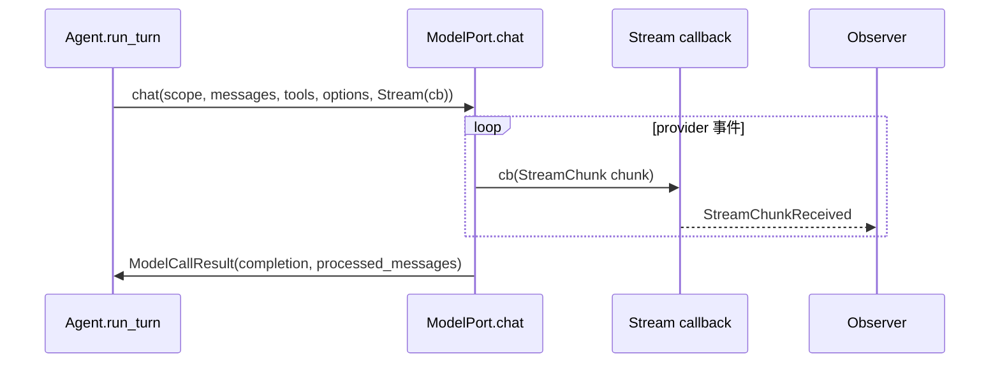

# 05 — 流式指南

流式（streaming）让你的模型回复边生成边送达：用户看到文字逐字出现，而不是干等
一个完整响应。本文讲清楚 Posoco 里流式是怎么设计的、模型适配器该怎么实现、宿主
和 observer 怎么消费。

## 1. 流式的开关：StreamMode

`ModelPort::chat` 的最后一个参数 `stream` 决定是否启用流式回调：

```moonbit
pub(open) trait ModelPort {
  async fn chat(
    Self,
    scope : InvocationScope,
    messages : ArrayView[Message],
    tools : Array[ToolDef],
    options : ChatOptions,
    stream : StreamMode,
  ) -> ModelCallResult raise ModelError
}

pub(all) enum StreamMode {
  NoStream
  Stream((StreamChunk) -> Unit)
}
```

- `NoStream`：适合后台任务、批处理，或不需要增量 UI 的调用。适配器可以完全跳过
  流式解析工作。
- `Stream(callback)`：适配器每解析到一个可消费的 chunk，就调用一次
  `callback`。**回调的载荷是 `StreamChunk`**——Posoco 的规范 chunk 类型，不是
  私有的 JSON 形状。

注意：无论是否流式，`chat` 最终都要返回完整的 `ModelCallResult`，其中
`completion` 是**完整、权威**的结果（完整文本、推理、工具调用、结束原因、用量）。
流式只是"边到边通知"，不是"分块返回"。

## 2. 两条数据路径

一次流式 chat 有两条同时存在、职责不同的路径：


```mermaid
sequenceDiagram
  participant Agent as Agent.run_turn
  participant Model as ModelPort.chat
  participant Host as Stream callback
  participant Obs as Observer

  Agent->>Model: chat(scope, messages, tools, options, Stream(cb))
  loop provider 事件
    Model->>Host: cb(StreamChunk chunk)
    Host-->>Obs: StreamChunkReceived
  end
  Model->>Agent: ModelCallResult(completion, processed_messages)
```

- **回调是实时通道**：给 UI / 遥测用的，载荷是规范的 `StreamChunk`。
- **返回值是最终事实**：必须包含完整文本、reasoning、tool calls、finish reason
  和 usage，不能只返回最后发出去的那一块。
- 没有 observer 时，Agent 不建立投影；适配器仍然可以用回调把数据直接交给宿主
  自己的 sink。

Posoco 导出的 `StreamChunk` 是规范 chunk 类型。官方 OpenAI / DeepSeek / Kimi
适配器都把它作为标准 SSE 解析和 `StreamAccumulator` 的输入。

## 3. 共享词汇表：StreamChunk

五种变体，覆盖文本、推理、工具调用、用量和结束：

```moonbit
pub(all) enum StreamChunk {
  TextDelta(token~ : String)
  ReasoningDelta(token~ : String)
  ToolCallDelta(
    index~ : Int,
    id~ : String?,
    name~ : String?,
    arguments_delta~ : String?
  )
  Usage(
    input_tokens~ : Int,
    output_tokens~ : Int,
    total_tokens~ : Int,
    cached_input_tokens~ : Int?,
    uncached_input_tokens~ : Int?
  )
  Finish(reason~ : String)
}
```

- `ToolCallDelta` 按 `index` 区分不同的工具调用；`id` / `name` 通常只出现在第一
  片，`arguments_delta` 是**增量拼接**的 JSON 字符串，直到 `Finish` 才完整。
- `Finish(reason)` 的值有 `"stop"`、`"length"`、`"tool_calls"` 等，会被映射成
  `FinishReason`。

## 4. StreamAccumulator：把碎片拼回完整结果

`StreamAccumulator` 是可选工具，帮适配器把共享 chunk 组装成最终的
`Completion`：

```moonbit
let acc = @posoco.StreamAccumulator()
acc.push(@posoco.StreamChunk::TextDelta(token="Hello"))
acc.push(@posoco.StreamChunk::TextDelta(token=" world"))
acc.push(
  @posoco.StreamChunk::ToolCallDelta(
    index=0,
    id=Some("call_1"),
    name=Some("echo"),
    arguments_delta=Some("{\"text\":\"hi\"}"),
  ),
)
acc.push(@posoco.StreamChunk::Finish(reason="tool_calls"))
let completion = acc.to_completion()
```

`to_completion()` 返回 `Completion`，并且会 raise `ModelError`。它负责：

- 合并文本和 reasoning 增量；
- 按 `index` 合并工具调用增量；
- 解析 arguments JSON；
- 把 `Finish.reason` 映射为 `FinishReason`；
- 用量齐全时填充 `Usage`。

**容错规则很严格**：工具调用缺 id、缺 name、缺 arguments JSON，或 arguments
JSON 畸形，统统 raise `ModelError::ResponseParse`。绝不把坏 JSON 变成 `{}`、
空字符串或一个看似成功的工具调用——损坏的流不能伪装成有效结果。

## 5. ModelPort 实现模式

推荐把"provider 解析"和"Posoco 回调"分开：解析出的每个 chunk 同时做两件事——
喂给 accumulator（拼最终结果）+ 转发给回调（实时通道）。这叫"双写"：

```moonbit
fn emit_chunk(
  stream : @posoco.StreamMode,
  acc : @posoco.StreamAccumulator,
  chunk : @posoco.StreamChunk,
) -> Unit {
  acc.push(chunk)
  match stream {
    @posoco.StreamMode::NoStream => ()
    @posoco.StreamMode::Stream(callback) => callback(chunk)
  }
}

pub impl @posoco.ModelPort for StreamingModel with fn chat(
  self,
  _scope : @posoco.InvocationScope,
  messages : ArrayView[@posoco.Message],
  _tools : Array[@posoco.ToolDef],
  _options : @posoco.ChatOptions,
  stream : @posoco.StreamMode,
) -> @posoco.ModelCallResult raise @posoco.ModelError {
  match stream {
    @posoco.StreamMode::NoStream => self.chat_without_stream(messages)
    @posoco.StreamMode::Stream(_) => {
      let acc = @posoco.StreamAccumulator()
      // 1. 打开 provider 的流。
      // 2. 把每个 provider 事件解析成一个或多个 StreamChunk。
      // 3. 每个 chunk 都调用 emit_chunk(stream, acc, chunk)。
      // 4. 只在收到 provider 明确的成功终态时停止。
      let completion = acc.to_completion()
      { completion, processed_messages: messages.to_owned() }
    }
  }
}
```

生产适配器的标准动作就是这套流程：解析 provider 事件 → 喂一次 accumulator →
转发一次 `StreamChunk` 回调 → 校验终态后返回 `ModelCallResult`。如果你的适配器有
更复杂的流式需求（比如 DeepSeek 在流式中动态移除工具结果），完全可以不依赖
accumulator，自己维护状态。

## 6. 终态与错误

**绝不要把"收到了一些文本"当成成功。** 适配器必须严格区分：

| 情形 | 处理 |
|------|------|
| 明确的成功终态（`[DONE]`、合法的 finish marker、校验过的 completed 事件） | 组装并返回 completion |
| 传输 / 读取失败 | `ModelError::Transport` |
| 事件畸形、工具参数不完整 | `ModelError::ResponseParse` |
| provider 明确失败 / 不完整 / 错误终态 | typed `ModelError`（按适配器约定通常是 Transport 或 ResponseParse） |
| 没等到明确成功终态就 EOF | typed 失败——绝不返回"部分成功" |

错误信息只包含有界的阶段/类别信息：不包含凭据、prompt 文本、工具参数、原始
provider 响应体、无界的 `error.to_string()` 载荷。畸形流 JSON 和畸形工具参数
JSON 同样适用这条规则。

## 7. Observer 侧消费

Agent 会把 `StreamChunk` 回调投影成 `TurnEvent::StreamChunkReceived` 事件。
如果宿主 observer 处理不过来，核心还会发出 `TurnEvent::StreamChunksDropped(count~)`
表示有 telemetry chunk 被丢弃；这是非终端事件，只用于遥测。

```moonbit
pub impl @posoco.Observer for TokenPrinter with fn on_event(
  _self,
  event : @posoco.TurnEvent,
) -> Unit {
  match event {
    @posoco.TurnEvent::StreamChunkReceived(chunk~) =>
      match chunk {
        @posoco.StreamChunk::TextDelta(token~) => println(token)
        @posoco.StreamChunk::ReasoningDelta(_) => ()
        _ => ()
      }
    @posoco.TurnEvent::TurnCompleted => println("")
    _ => ()
  }
}
```

如果你的产品需要**无损**的工具调用增量或用量遥测，就在宿主 sink 里直接消费
适配器的 `StreamChunk` 回调，不要试图从最终 transcript 里重建。最终的
`TurnResult.message` 始终是权威的 assistant 消息。

## 8. 测试清单

一个流式 ModelPort 至少应覆盖：

```moonbit
test "accumulator assembles streamed completion" {
  let acc = @posoco.StreamAccumulator()
  acc.push(@posoco.StreamChunk::TextDelta(token="Hi"))
  acc.push(@posoco.StreamChunk::TextDelta(token=" there"))
  acc.push(@posoco.StreamChunk::Usage(
    input_tokens=10,
    output_tokens=2,
    total_tokens=12,
  ))
  acc.push(@posoco.StreamChunk::Finish(reason="stop"))
  let completion = acc.to_completion()
  assert_eq(completion.message.content, [@posoco.Content::Text("Hi there")])
}
```

还要测：

- `NoStream` 不会调用回调；
- 每个流式 chunk 恰好转发一次；
- 合法的终态事件返回一个完整的 `ModelCallResult`；
- 干净 EOF、provider 失败、畸形 JSON 都抛 typed 错误；
- 缺工具调用字段、arguments 畸形时抛 `ResponseParse`，且不泄漏原始载荷；
- 组合好的 Agent 会发出 `StreamChunkReceived` 事件，恰好一个 terminal turn
  事件；如果 observer 慢到积压，还会看到 `StreamChunksDropped`。

写扩展时用 testkit 里的 `ScriptedModelStep::Stream` 做一致性假件很方便，但它是
测试专用 API——生产扩展要直接实现 `ModelPort` 和 `Extension`。